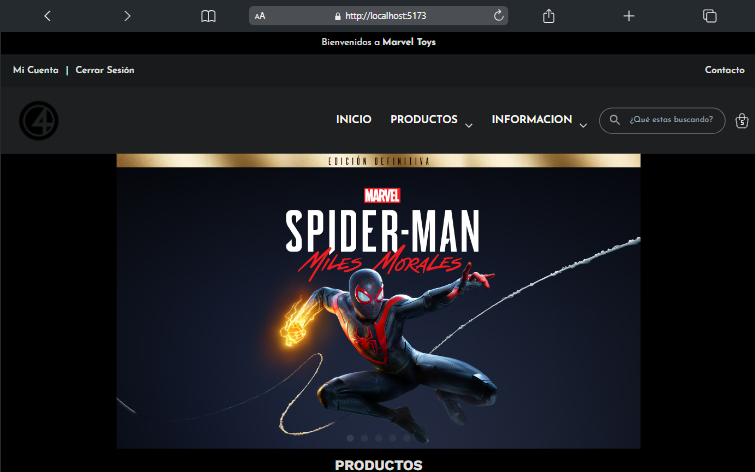

## Marvel Toys

Marvel Toys es un sitio de comercio electrónico desarrollado con la última versión de React y Vite. La tienda está completamente estilizada con Tailwind CSS y CSS adicional, y se encuentra desplegada en producción en Vercel.

## Vista previa en vivo

[](https://marvel-toys.vercel.app)

## Características

- **Inicio de sesión:** Implementado con Clerk.
- **Pasarela de pagos:** Integrada con PayPal.
- **Estilos:** Principalmente con Tailwind CSS, pero también incluye CSS personalizado.
- **Estado global:** Manejado con Zustand.
- **Contacto:** Configurado con EmailJS.
- **Páginas específicas:** Productos, categorías, búsqueda, producto individual, carrito, información de usuario y contacto.
- **Búsqueda completa:** Filtra productos por nombre, categoría y precio.
- **Categorías y ordenamiento:** Filtra productos por categorías y ordena por precio, mayor a menor y viceversa.
- **Modo oscuro:** Soporte para tema oscuro.

### Configuración del proyecto

1. Clone the project

```bash
$ git clone https://github.com/jamstack-cms/jamstack-ecommerce.git
```

2. Install the dependencies:

```bash
$ yarn

# or

$ npm install
```

3. Run the project

```bash
$ npm run dev

# or to build

$ npm run build
```

## Deploy to Vercel

Use the [Vercel CLI](https://vercel.com/download)

```bash
vercel
```

## Estructura del proyecto

- **`src/lib/data.ts`**: Contiene toda la data de clasificación de productos, incluyendo nombres, imágenes, precios, etc.
- **`src/store/buyStore`**: Estado global manejado con Zustand.
- **`src/pages`**: Contiene las páginas principales: inicio, productos, categorías, búsqueda, producto individual, carrito, información de usuario y contacto.
- **`src/components`**: Componentes reutilizables para la tienda, incluyendo botones, formularios y otros elementos UI.
- **`src/Layouts`**: Contiene las redirecciones de Clerk que protegen las rutas y el 404.

## Configuración de terceros

### Clerk

Para la autenticación, se utiliza Clerk. Asegúrate de configurar tus credenciales en el archivo de entorno y en Vercel.

### PayPal

La pasarela de pagos está integrada con PayPal. Configura tu cuenta de PayPal y actualiza las credenciales en el proyecto.

### EmailJS

Para el envío de correos electrónicos de contacto, se utiliza EmailJS. Asegúrate de configurar las credenciales en el archivo de entorno.

## Contribuciones

¿Tienes una idea o una solicitud? ¡Envía un problema o una solicitud de incorporación de cambios en el repositorio de GitHub!

## Licencia

Este proyecto está licenciado bajo la Licencia MIT.
